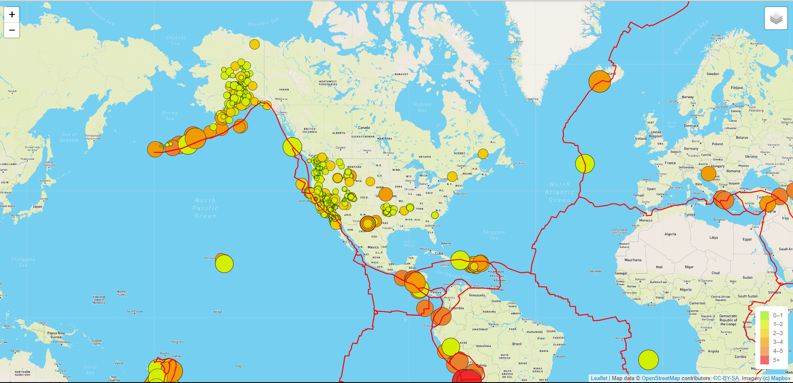

# Mapping_Earthquakes
## Overview
The purpose of this project is to visually show the differences between the magnitudes of earthquakes all over the world for the last seven days.
---
## Results
I created this map using three different styles:

Dark-

Satellite - 

Street- 

